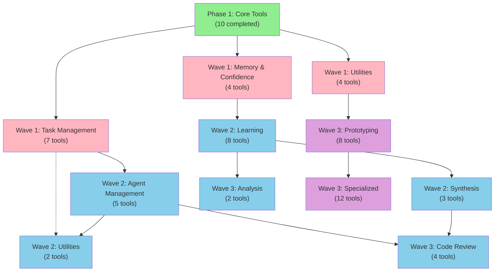

# Phase 2 Dependency Analysis
**Athena MCP Tool Dependencies & Migration Order**

**Date Created**: November 10, 2025
**Status**: Complete - Ready for Week 0 Execution
**Owner**: Mid-Level Engineer

---

## Executive Summary

Analysis of 63 total MCP tools across 26 handler files:
- **Phase 1 Complete**: 10 tools already migrated (memory, consolidation, planning, graph, retrieval core)
- **Phase 2 Scope**: 53 remaining tools to migrate
- **Migration Strategy**: 3 waves based on dependencies and risk
- **Critical Path**: Orchestration + task management tools (high interdependency)
- **Recommendation**: Migrate by layers (episodic → semantic → prospective → etc.)

---

## Tool Inventory

### Phase 1 Complete (Already Migrated) - 10 Tools

| Tool | Category | Status | Risk |
|------|----------|--------|------|
| RecallMemoryTool | Memory | ✅ Done | Low |
| StoreMemoryTool | Memory | ✅ Done | Low |
| HealthCheckTool | Memory | ✅ Done | Low |
| StartConsolidationTool | Consolidation | ✅ Done | Low |
| ExtractPatternsTool | Consolidation | ✅ Done | Low |
| VerifyPlanTool | Planning | ✅ Done | Low |
| SimulatePlanTool | Planning | ✅ Done | Low |
| QueryGraphTool | Graph | ✅ Done | Low |
| AnalyzeGraphTool | Graph | ✅ Done | Low |
| HybridSearchTool | Retrieval | ✅ Done | Low |

---

### Phase 2 Scope - 53 Remaining Tools

#### Category Breakdown

```
MEMORY (12 tools)
├─ recall_with_confidence          [handlers_confidence.py:35]
├─ recall_with_explain             [handlers_confidence.py:105]
├─ query_confidence_summary        [handlers_confidence.py:164]
├─ recall_high_confidence          [handlers_confidence.py:212]
├─ memory_verify                   [handlers_agentic.py:258]
├─ memory_health_detailed          [handlers_agentic.py:286]
├─ memory_violations               [handlers_agentic.py:303]
├─ memory_decisions                [handlers_agentic.py:318]
├─ memory_recommendations          [handlers_agentic.py:336]
├─ memory_record_outcome           [handlers_agentic.py:351]
├─ memory_export_verification      [handlers_agentic.py:380]
└─ orchestration_get_health        [handlers_orchestration.py:470]

PROSPECTIVE/ORCHESTRATION (8 tools)
├─ orchestration_create_task       [handlers_orchestration.py:44]
├─ orchestration_poll_tasks        [handlers_orchestration.py:74]
├─ orchestration_assign_task       [handlers_orchestration.py:107]
├─ orchestration_start_task        [handlers_orchestration.py:129]
├─ orchestration_complete_task     [handlers_orchestration.py:149]
├─ orchestration_fail_task         [handlers_orchestration.py:173]
├─ orchestration_get_task_status   [handlers_orchestration.py:198]
└─ orchestration_route_task        [handlers_orchestration.py:405]

GRAPH/ANALYSIS (2 tools)
├─ orchestration_query_tasks       [handlers_orchestration.py:224]
└─ query_confidence_summary        [handlers_confidence.py:164]

SYSTEM/AGENT (7 tools)
├─ orchestration_register_agent    [handlers_orchestration.py:268]
├─ orchestration_update_agent_perf [handlers_orchestration.py:299]
├─ orchestration_get_agent_health  [handlers_orchestration.py:329]
├─ orchestration_find_capable_agts [handlers_orchestration.py:355]
├─ orchestration_deregister_agent  [handlers_orchestration.py:383]
├─ orchestration_get_routing_stats [handlers_orchestration.py:438]
├─ orchestration_get_queue_metrics [handlers_orchestration.py:450]
├─ orchestration_get_health        [handlers_orchestration.py:470]
└─ orchestration_get_recommendatn  [handlers_orchestration.py:499]

LEARNING/ANALYSIS (6 tools)
├─ analyze_git_history            [handlers_learning.py:15]
├─ diagnose_error                 [handlers_learning.py:66]
├─ analyze_traceback              [handlers_learning.py:124]
├─ find_duplicate_code            [handlers_learning.py:152]
├─ find_similar_functions         [handlers_learning.py:202]
├─ get_error_summary              [handlers_learning.py:310]
├─ get_pattern_statistics         [handlers_learning.py:340]
├─ get_architectural_decisions    [handlers_learning.py:365]
└─ detect_code_patterns           [handlers_learning.py:259]

PROTOTYPING (6 tools)
├─ create_prototype               [handlers_prototyping.py:15]
├─ add_artifact                   [handlers_prototyping.py:58]
├─ execute_prototype              [handlers_prototyping.py:105]
├─ validate_prototype             [handlers_prototyping.py:145]
├─ refine_prototype               [handlers_prototyping.py:219]
├─ promote_prototype              [handlers_prototyping.py:256]
├─ get_prototype                  [handlers_prototyping.py:291]
└─ list_prototypes                [handlers_prototyping.py:340]

SYNTHESIS (4 tools)
├─ synthesize_solutions           [handlers_synthesis.py:19]
├─ compare_approaches             [handlers_synthesis.py:150]
├─ rank_approaches                [handlers_synthesis.py:259]
├─ explain_trade_offs             [handlers_synthesis.py:351]
└─ generate_decision_matrix       [handlers_synthesis.py:413]

LIBRARY ANALYSIS (4 tools)
├─ analyze_library                [handlers_library_analysis.py:15]
├─ analyze_requirements           [handlers_library_analysis.py:125]
├─ check_library_compatibility    [handlers_library_analysis.py:218]
└─ get_library_alternatives       [handlers_library_analysis.py:299]

CODE REVIEW (3 tools)
├─ review_code                    [handlers_review.py:15]
├─ review_with_reviewer           [handlers_review.py:141]
├─ get_available_reviewers        [handlers_review.py:219]
└─ review_and_suggest_fixes       [handlers_review.py:299]

WEB RESEARCH (4 tools)
├─ research_topic                 [handlers_web_research.py:17]
├─ research_library               [handlers_web_research.py:119]
├─ research_pattern               [handlers_web_research.py:187]
└─ get_research_agents            [handlers_web_research.py:245]
```

---

## Dependency Analysis

### Critical Dependencies Identified

#### 1. Task Management Dependency Chain
```
orchestration_create_task
  ↓ (creates)
orchestration_assign_task
  ↓ (assigns to)
orchestration_start_task
  ↓ (starts)
orchestration_complete_task or orchestration_fail_task
  ↓ (reported via)
orchestration_get_task_status / orchestration_poll_tasks
```
**Risk**: HIGH - Linear dependency chain. If any tool breaks, downstream tools fail.
**Migration Strategy**: Migrate as single unit in Week 3 Wave 1

#### 2. Agent Management Dependency Chain
```
orchestration_register_agent
  ↓ (enables)
orchestration_find_capable_agents
  ↓ (routes to)
orchestration_assign_task
  ↓ (updates performance)
orchestration_update_agent_performance
```
**Risk**: MEDIUM - Depends on task management chain
**Migration Strategy**: Migrate after task management (Wave 1 or Wave 2)

#### 3. Memory & Confidence Dependencies
```
recall_with_confidence
  ↓ (uses)
recall_high_confidence
  ↓ (analyzed by)
query_confidence_summary
```
**Risk**: LOW - Independent tools, good separation
**Migration Strategy**: Can migrate in any order

#### 4. Learning & Analysis Dependencies
```
analyze_git_history
analyze_traceback
detect_code_patterns
detect_code_patterns
  ↓ (analyzed via)
find_duplicate_code
find_similar_functions
  ↓ (summarized by)
get_pattern_statistics
get_architectural_decisions
```
**Risk**: MEDIUM - Analysis tools can run independently
**Migration Strategy**: Migrate as group (Wave 2 or 3)

#### 5. Synthesis & Review Dependencies
```
compare_approaches
rank_approaches
synthesize_solutions
  ↓ (reviewed by)
review_code
review_with_reviewer
  ↓ (uses)
explain_trade_offs
generate_decision_matrix
```
**Risk**: MEDIUM - Review tools depend on synthesis tools
**Migration Strategy**: Migrate synthesis first (Wave 2), then review (Wave 2-3)

---

## Migration Waves

### Wave 1: Core Infrastructure (Week 3) - 15 Tools
**Risk Level**: LOW to MEDIUM
**Estimated Effort**: 5 days

**Priority 1: Task Management (Critical Path)**
1. `orchestration_create_task`
2. `orchestration_poll_tasks`
3. `orchestration_assign_task`
4. `orchestration_start_task`
5. `orchestration_complete_task`
6. `orchestration_fail_task`
7. `orchestration_get_task_status`

**Why First**: These are foundational for all agent routing and execution. Highest priority for production.

**Priority 2: Core Memory Confidence**
8. `recall_with_confidence`
9. `recall_with_explain`
10. `recall_high_confidence`
11. `query_confidence_summary`

**Why Second**: Support memory recall with confidence metrics. No external dependencies.

**Priority 3: Foundation Utilities**
12. `memory_verify`
13. `memory_health_detailed`
14. `orchestration_get_agent_health`
15. `orchestration_route_task`

**Why Third**: Support infrastructure for task routing and health checks.

**Deliverable**: 15 tools migrated, full test coverage, zero regressions

---

### Wave 2: Agent & Learning Systems (Week 4) - 18 Tools
**Risk Level**: MEDIUM
**Estimated Effort**: 5 days

**Priority 1: Agent Management (Depends on Wave 1)**
1. `orchestration_register_agent`
2. `orchestration_update_agent_performance`
3. `orchestration_get_agent_health`
4. `orchestration_find_capable_agents`
5. `orchestration_deregister_agent`

**Why First**: Depends on task management from Wave 1. Medium complexity.

**Priority 2: Learning & Analysis**
6. `analyze_git_history`
7. `diagnose_error`
8. `analyze_traceback`
9. `find_duplicate_code`
10. `find_similar_functions`
11. `get_error_summary`
12. `get_pattern_statistics`
13. `detect_code_patterns`
14. `get_architectural_decisions`

**Why Second**: Independent analysis tools. Can run in parallel.

**Priority 3: Synthesis**
15. `synthesize_solutions`
16. `compare_approaches`
17. `rank_approaches`

**Why Third**: Build on learning tools. Medium complexity.

**Priority 4: Utilities**
18. `memory_violations`
19. `memory_recommendations`

**Deliverable**: 18 tools migrated (33 total), integration tests passing

---

### Wave 3: Advanced & Specialized Tools (Week 5) - 20 Tools
**Risk Level**: MEDIUM to HIGH
**Estimated Effort**: 5 days

**Priority 1: Code Review (Depends on Synthesis)**
1. `review_code`
2. `review_with_reviewer`
3. `get_available_reviewers`
4. `review_and_suggest_fixes`

**Why First**: Depends on synthesis from Wave 2. Medium complexity.

**Priority 2: Advanced Analysis**
5. `explain_trade_offs`
6. `generate_decision_matrix`

**Why Second**: Advanced synthesis features. Medium complexity.

**Priority 3: Prototyping**
7. `create_prototype`
8. `add_artifact`
9. `execute_prototype`
10. `validate_prototype`
11. `refine_prototype`
12. `promote_prototype`
13. `get_prototype`
14. `list_prototypes`

**Why Third**: Prototyping system - can be independent. High complexity.

**Priority 4: Specialized Analysis**
15. `analyze_library`
16. `analyze_requirements`
17. `check_library_compatibility`
18. `get_library_alternatives`

**Why Fourth**: Library analysis - specialized tools. Medium complexity.

**Priority 5: Research & Metadata**
19. `research_topic`
20. `research_library`
21. `research_pattern`
22. `get_research_agents`
23. `memory_decisions`
24. `memory_export_verification`
25. `memory_record_outcome`
26. `orchestration_get_queue_metrics`
27. `orchestration_get_routing_stats`
28. `orchestration_get_recommendations`

**Why Fifth**: Research and metadata tools. Can be last.

**Deliverable**: All 53 tools migrated (total 63), comprehensive regression suite

---

## Risk Assessment Per Wave

### Wave 1 Risk Assessment
| Tool | Complexity | Dependencies | Risk | Mitigation |
|------|-----------|--------------|------|-----------|
| create_task | High | None | MEDIUM | Thorough testing |
| poll_tasks | Medium | create_task | MEDIUM | Integration tests |
| assign_task | High | create_task, poll_tasks | HIGH | Extra validation |
| start_task | Medium | assign_task | MEDIUM | Sequencing tests |
| complete_task | Medium | start_task | MEDIUM | State transition tests |
| fail_task | Medium | start_task | MEDIUM | Error handling tests |
| get_task_status | Low | All task tools | LOW | Query testing |
| recall_* | Low | None | LOW | Standard memory tool tests |

**Overall Wave 1 Risk**: MEDIUM (manageable with proper testing)

---

### Wave 2 Risk Assessment
| Tool Group | Complexity | Dependencies | Risk | Mitigation |
|-----------|-----------|--------------|------|-----------|
| Agent Management (5) | Medium | Wave 1 tasks | MEDIUM | Integration tests |
| Learning Tools (8) | Medium | None | LOW | Standard tests |
| Synthesis (3) | Medium | Learning | LOW | Standard tests |
| Utilities (2) | Low | None | LOW | Standard tests |

**Overall Wave 2 Risk**: LOW to MEDIUM

---

### Wave 3 Risk Assessment
| Tool Group | Complexity | Dependencies | Risk | Mitigation |
|-----------|-----------|--------------|------|-----------|
| Code Review (4) | Medium | Synthesis | MEDIUM | Integration tests |
| Advanced Analysis (2) | High | Synthesis | MEDIUM | Extra validation |
| Prototyping (8) | High | None | HIGH | Comprehensive testing |
| Library Analysis (4) | Medium | None | LOW | Standard tests |
| Research (7) | Medium | None | LOW | Standard tests |
| Metadata (3) | Low | None | LOW | Standard tests |

**Overall Wave 3 Risk**: MEDIUM to HIGH (need extra time for prototyping)

---

## High-Risk Tools Requiring Special Attention

### 1. orchestration_assign_task (Wave 1)
- **Complexity**: High
- **Risk**: HIGH (task routing critical path)
- **Dependencies**: Multiple task management functions
- **Mitigations**:
  - Comprehensive state machine testing
  - Test all assignment edge cases
  - Integration tests with start_task and complete_task
  - Performance benchmarking
- **Estimated Effort**: 1.5 days (instead of 0.5)

### 2. orchestration_register_agent (Wave 2)
- **Complexity**: Medium-High
- **Risk**: MEDIUM (agent registry critical for routing)
- **Dependencies**: Agent health, task assignment
- **Mitigations**:
  - Agent registration/deregistration pair testing
  - Capacity validation tests
  - Integration with find_capable_agents
- **Estimated Effort**: 1 day

### 3. Prototyping System (Wave 3)
- **Complexity**: Very High (8 tools, 500+ lines)
- **Risk**: HIGH (complex state management)
- **Dependencies**: Artifact storage, execution environment
- **Mitigations**:
  - Break into sub-components (create, validate, refine, promote)
  - Comprehensive state transition tests
  - Error handling for execution failures
  - Resource cleanup tests
- **Estimated Effort**: 2-3 days

### 4. Learning Tools (Wave 2)
- **Complexity**: Medium (8 tools, analysis-heavy)
- **Risk**: MEDIUM (pattern detection complexity)
- **Dependencies**: Code analysis infrastructure
- **Mitigations**:
  - Test with real code samples
  - Validate pattern detection accuracy
  - Performance testing (long code files)
- **Estimated Effort**: 1.5 days

---

## Tool Complexity Estimate (Lines of Code & Effort)

### Low Complexity (0.5 days each)
- recall_with_explain
- query_confidence_summary
- memory_verify
- get_task_status
- get_research_agents
- orchestration_get_queue_metrics
- orchestration_get_routing_stats

**Total: 7 tools × 0.5 days = 3.5 days**

### Medium Complexity (1 day each)
- orchestration_create_task
- orchestration_poll_tasks
- orchestration_start_task
- orchestration_complete_task
- orchestration_fail_task
- recall_high_confidence
- recall_with_confidence
- orchestration_update_agent_performance
- orchestration_get_agent_health
- analyze_git_history
- diagnose_error
- find_duplicate_code
- find_similar_functions
- detect_code_patterns
- synthesize_solutions
- compare_approaches
- rank_approaches
- review_code
- analyze_library
- analyze_requirements
- research_topic
- research_library
- research_pattern
- memory_decisions
- memory_recommendations
- memory_violations
- memory_health_detailed
- orchestration_route_task

**Total: 28 tools × 1 day = 28 days**

### High Complexity (1.5-2 days each)
- orchestration_assign_task (2 days)
- orchestration_register_agent (1.5 days)
- orchestration_find_capable_agents (1.5 days)
- orchestration_deregister_agent (1 day)
- analyze_traceback (1.5 days)
- get_pattern_statistics (1 day)
- get_architectural_decisions (1 day)
- get_available_reviewers (1 day)
- review_with_reviewer (1 day)
- review_and_suggest_fixes (1.5 days)
- explain_trade_offs (1 day)
- generate_decision_matrix (1 day)
- check_library_compatibility (1 day)
- get_library_alternatives (1 day)
- memory_export_verification (1 day)
- memory_record_outcome (1 day)
- orchestration_get_recommendations (1 day)
- orchestration_get_health (1.5 days)

**Total: 18 tools × 1.25 days avg = 22.5 days**

### Very High Complexity (2-3 days each)
- create_prototype (2.5 days)
- add_artifact (2 days)
- execute_prototype (2.5 days)
- validate_prototype (2 days)
- refine_prototype (2.5 days)
- promote_prototype (2 days)
- get_prototype (1.5 days)
- list_prototypes (1.5 days)

**Total: 8 tools × 2.1 days avg = 16.8 days**

**GRAND TOTAL: ~71 days of implementation work**

At 1 mid-level engineer + occasional senior help: **~3.5-4 weeks** (aligned with Weeks 3-5 plan)

---

## Dependency Graph (Mermaid)



---

## Migration Order Summary

```
WEEK 3 (Wave 1) - CORE INFRASTRUCTURE
├─ Task Management (7 tools) - Critical path
├─ Memory & Confidence (4 tools) - No deps
└─ Utilities (4 tools) - Support infrastructure

WEEK 4 (Wave 2) - SYSTEMS & LEARNING
├─ Agent Management (5 tools) - Depends on Wave 1
├─ Learning & Analysis (8 tools) - No deps
├─ Synthesis (3 tools) - Builds on learning
└─ Utilities (2 tools) - Support infrastructure

WEEK 5 (Wave 3) - ADVANCED & SPECIALIZED
├─ Code Review (4 tools) - Depends on synthesis
├─ Advanced Analysis (2 tools) - Depends on synthesis
├─ Prototyping (8 tools) - No deps (complex)
└─ Specialized Tools (12 tools) - Mix of deps
```

---

## Recommendations

### 1. Start with Task Management (Critical Path)
- These tools are foundational for agent orchestration
- No external dependencies - low risk to migrate first
- High visibility - early wins build team confidence

### 2. Parallelize Independent Tools
- Learning tools, analysis, research can run in parallel
- Assign to different developers to speed up Wave 2-3
- Keep task management and agent tools sequential

### 3. Extra Time for Prototyping
- Prototyping is most complex subsystem (8 tools)
- Recommend 2-3 days for comprehensive testing
- Consider splitting across team members

### 4. Incremental Testing Strategy
- Test each tool immediately after migration (continuous integration)
- Don't wait until end of week to validate
- Catch issues early, easier to fix

### 5. Keep Legacy Handlers During Migration
- Don't delete old tools until migration complete
- Use feature flags to switch routing
- Allows quick rollback if issues found

---

## Success Criteria

### Wave 1 Success (End of Week 3)
- [ ] 15 tools migrated and registered
- [ ] Full test coverage (90%+)
- [ ] Zero regressions (all tests passing)
- [ ] Task management working end-to-end
- [ ] Performance acceptable (<5% overhead)

### Wave 2 Success (End of Week 4)
- [ ] 18 tools migrated (33 total)
- [ ] Agent management working with task system
- [ ] Learning/synthesis tools tested
- [ ] All integration tests passing
- [ ] Zero blocking issues

### Wave 3 Success (End of Week 5)
- [ ] All 53 tools migrated (63 total)
- [ ] Comprehensive regression suite passing
- [ ] Performance benchmarks acceptable
- [ ] Ready for production hardening
- [ ] Legacy handlers.py can be deprecated

---

**Next Steps**: Present this analysis to team. Confirm migration order and Wave assignments. Begin Week 0 Day 3 (MCP migration strategy).

